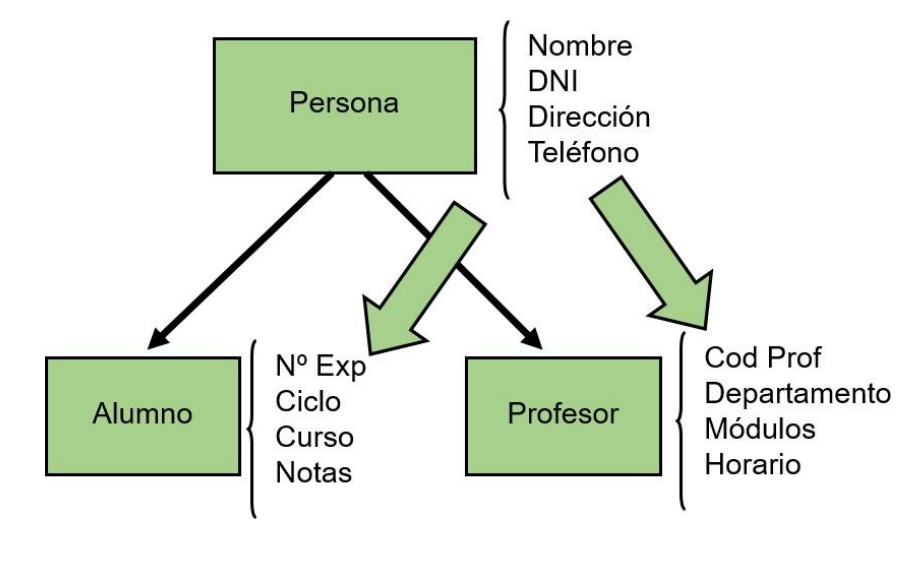
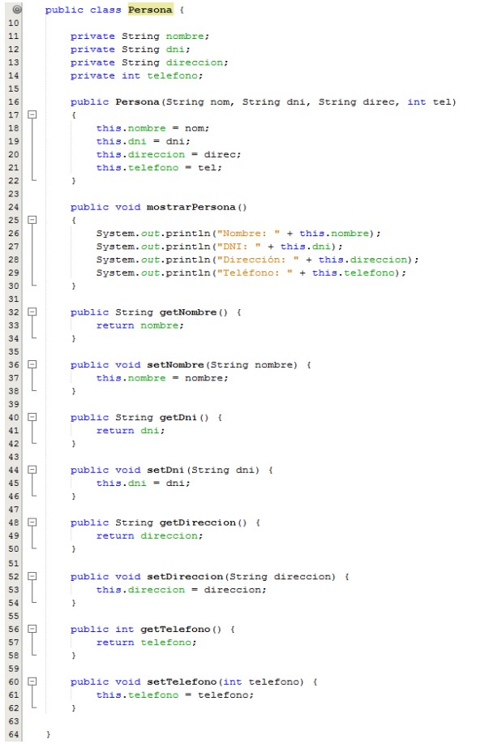
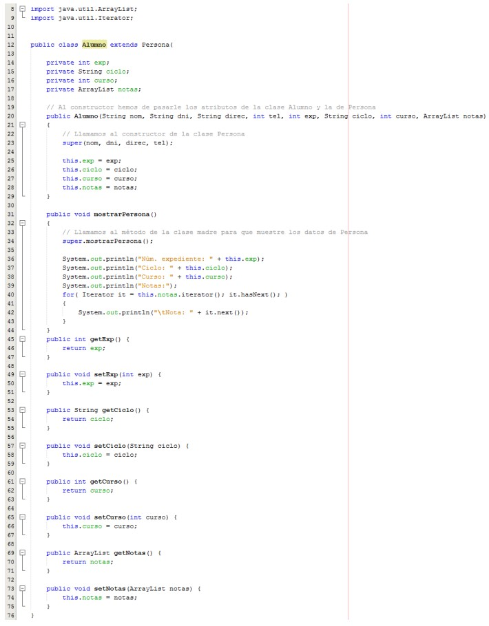
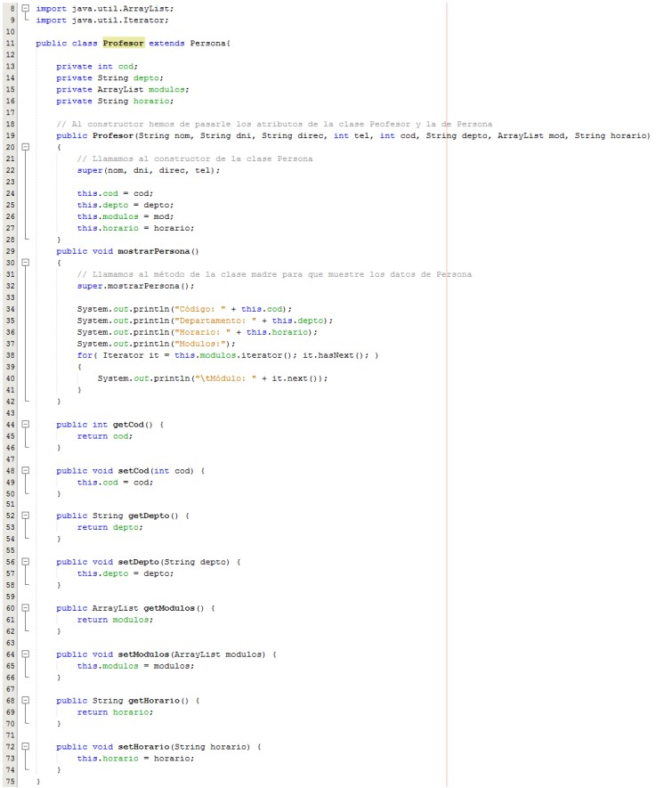
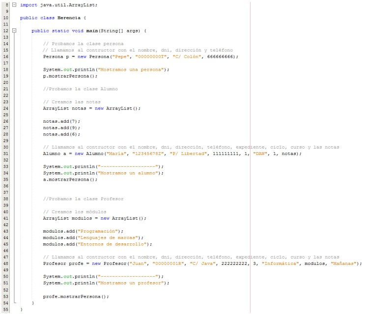
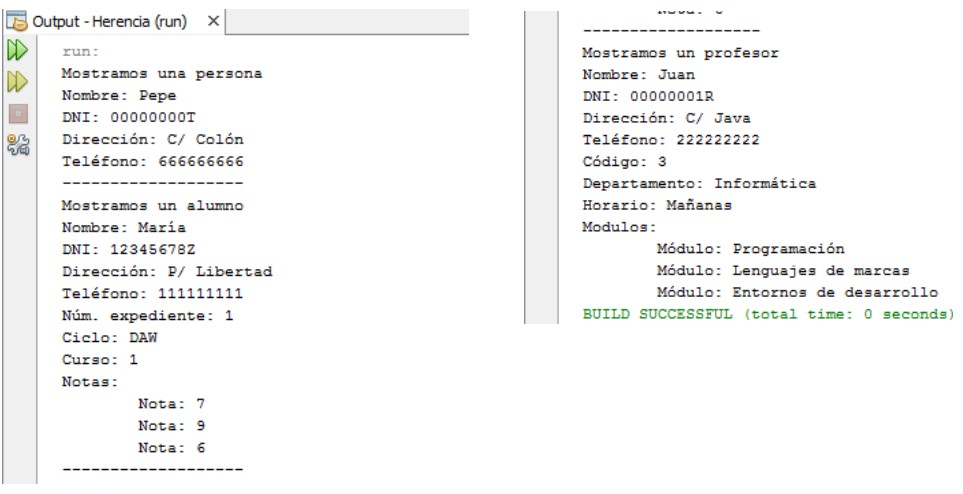

# 2. Herència

## 2.1 Introducció

L'herència és una de les capacitats més importants i distintives de la POO. Consisteix en derivar o **estendre una classe nova a partir d'una altra ja existent de manera que la classe nova hereta tots els atributs i mètodes de la classe ja existent**.

A la classe ja existent se la denomina **superclasse**, classe base o classe pare. A la nova classe se la denomina **subclasse**, classe derivada o classe filla.

>[!WARNING] <strong>ATENCIÓ!:</strong>
>Quan derivem (o estenem) una nova classe, aquesta hereta totes les dades i mètodes membre de la classe existent.

<u>Per exemple</u>, si tenim un programa que treballarà amb alumnes i professors, aquests tindran atributs comuns com el nom, DNI, adreça o telèfon. Però cadascun d'ells tindran atributs específics que no tinguen els altres. Per exemple els i les alumnes tindran el número d'expedient, el cicle i curs que cursen i les seues notes; per la seua part els i les docents tindran el codi de professor, el departament al qual pertanyen, els mòduls que imparteixen i el seu horari. Per tant, en aquest cas el millor és declarar una classe <i>Persona</i> amb els atributs comuns (Nom, DNI, Adreça, Telèfon) i dos sub-classes <i>Alumne</i> i <i>Professor</i> que hereten de Persona (a més de tindre els seus propis atributs). Es important remarcar que Alumne i Professor també heretaran tots els mètodes de Persona.



A Java s'utilitza la paraula reservada **`extends`** per a indicar herència:

```java
public class Alumne extends Persona {
...
}
public class Professor extends Persona {
...
}
```

## 2.2 Constructors de classes derivades

El constructor d'una classe derivada ha d'encarregar-se de construir els atributs que estiguen definits en la classe base a més dels seus propis atributs. Dins del constructor de la classe derivada, per a cridar al constructor de la classe base es deu utilitzar el mètode reservat `super()` passant-li com a argument els paràmetres que necessite. Si no es crida explícitament al constructor de la classe base mitjançant super() el compilador cridarà automàticament al constructor per defecte de la classe base. Si no té constructor per defecte el compilador generarà un error.

## 2.3 Mètodes heretats i sobreescrits

Hem vist que una subclasse hereta els atributs i mètodes de la superclasse; a més, es poden incloure nous atributs i nous mètodes. D'altra banda, pot ocórrer que algun dels mètodes que existeixen en la superclasse no ens valguen en la subclasse (tal com estan programats) i necessitem adequar-los a les característiques de la subclasse. Això pot fer-se mitjançant la sobreescriurà de mètodes.

**Un mètode està sobreescrit quan es programa de nou en la classe derivada**. Per exemple el mètode <i>mostrarPersona()</i> de la classe <i>Persona</i> el necessitaríem sobreescriure en les classes <i>Alumne</i> i <i>Professor</i> per a mostrar també els nous atributs.

El mètode sobreescrit en la classe derivada podria reutilitzar el mètode de la classe base, si és necessari, i a continuació imprimir els nous atributs. En Java podem accedir a mètodes definits en la classe base mitjançant **super.mètode()**.
El mètode mostrarPersona sobreescrit en les classes derivades podria ser:

```java
super.mostrarPersona(); // Anomenada al mètode de la classe base
System.out.println(…); // Imprimim els atributs exclusius de la classe derivada
```

## 2.4 Classes i mètodes final

>[!IMPORTANT]<strong>IMPORTANT!</strong>
><ul>
><li>Una classe <strong>final</strong> no pot ser heretada.</li> <li>Un mètode <strong>final</strong> no pot ser sobreescrit per les subclasses.</li></ul>

## 2.5 Accés a membres derivats

Encara que una subclasse inclou tots els membres de la seua superclasse, no podrà accedir a aquells que hagen sigut declarats com private. Si en l'exemple 3 (següent apartat) intentàrem accedir des de les classes derivades als atributs de la classe <i>Persona</i> (que són privats) obtindríem un error de compilació.

També podem declarar els atributs com **protected**. D'aquesta manera podran ser accedits des de les classes heretades (mai des d'altres classes).

>[!IMPORTANT]<strong>IMPORTANT!</strong>
>Els atributs declarats com <strong>protected</strong> son públics per a les classes heretades i privats per a les altres classes.

## 2.6 Exemple 3

En aquest exemple crearem les classe **Persona** i les seues classes heretades: **Alumne** i **Professor**. En la classe Persona crearem el constructor, un mètode per a mostrar els atributs i els <i>getters</i> i <i>setters</i>. **Les classes Alumne i Professor heretaran de la classe Persona** (utilitzant la paraula reservada `extends`) i cadascuna tindrà els seus propis atributs, un constructor que anomenarà també al constructor de la classe Persona (utilitzant el mètode `super()`), un mètode per a mostrar els seus atributs, que també cridarà al mètode de Persona i els getters i setters. És interessant veure com **s'ha sobreescrit el mètode mostrarPersona() en les classes heretades**. El mètode es diu igual i fa ús de la paraula reservada super per a cridar al mètode de mostrarPersona() de Persona. En la crida del main, tant l'objecte **a** (Alumne) com l'objecte **profe** (Professor) poden fer ús del mètode mostrarPersona().

### Persona



### Alumne



### Professor



### Programa Principal



### Eixida


